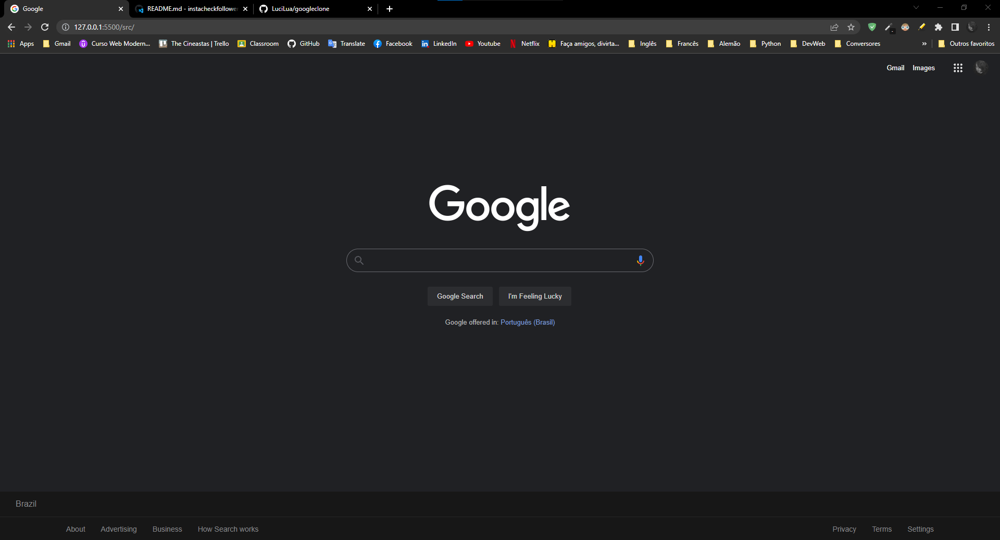

<p align="center"></p>
<p align="center">Google clone template</p>
<h1 align="center">
 
  

</br>
</h1>
</br>

## 🛠 Technologies used

</br>

 

## 🚀 How to start

> clone the repository
```bash
git clone https://github.com/LuciLua/googleclone.git
```

> open project folder
 ```bash
cd ./googleclone
```

## 🖼 Preview

**So far, this is the preview**


